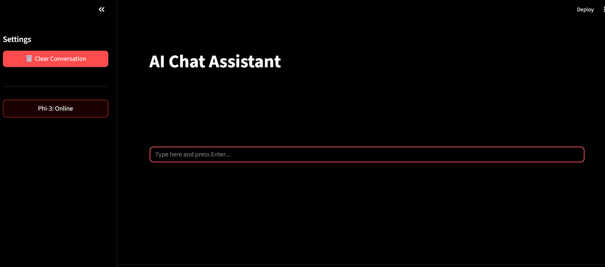
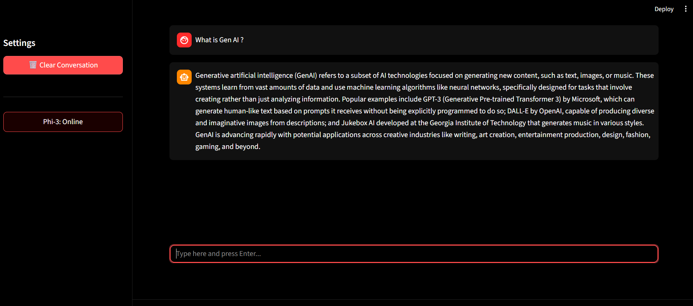

# 🤖 AI Chat Assistant (Local LLM Powered)

An interactive AI chatbot built using Streamlit and powered by a local LLM (Phi-3 via Ollama).

This project replicates a ChatGPT-like experience with a clean dark UI and real-time responses.

---

## 🚀 Features

- 💬 ChatGPT-like conversational interface
- ⚡ Fast responses using local LLM (Phi-3)
- 🎨 Custom dark UI (zero white space design)
- 🧠 Session-based chat memory
- 🔄 Clear conversation button
- 📌 Fixed bottom input bar (modern UX)

---

## 🛠️ Tech Stack

- Python
- Streamlit
- Ollama (Phi-3)
- Requests

---

## 📸 Screenshots

### Chat UI


### Response Example


---

## ⚙️ Setup Instructions

### 1. Clone Repository
```bash
git clone https://github.com/Shruti-03-06/AI-Assistant-Chatbot.git
cd AI-Assistant-Chatbot
```

### 2. Install Dependencies
```bash
pip install -r requirements.txt
```

### 3. Run Ollama
```bash
ollama pull phi3
ollama serve
```

### 4. Run App
```bash
python -m streamlit run app.py
```

---

## 📂 Project Structure

```
AI-Assistant-Chatbot/
│
├── app.py
├── ollama.py
├── requirements.txt
├── screenshots/
└── README.md
```

---

## 💡 Key Learnings

- Local LLM integration using Ollama  
- Building interactive UI with Streamlit  
- Handling API-based responses  
- Improving UX with custom CSS  

---

## 🔮 Future Improvements

- Streaming responses (typing effect)
- Voice assistant integration
- Chat history saving (database)
- Multi-model support

---

## 👩‍💻 Author

Shruti Jain  
Aspiring Data Analyst  

🔗 GitHub: https://github.com/Shruti-03-06  
🔗 LinkedIn:https://www.linkedin.com/in/shruti-jain-a094aa233/
---

## ⭐ Support

If you like this project, give it a ⭐ on GitHub!
